# Este repositório foi criado para documentar estudos sobre Apache Kafka

## O que é Apache Kafka ?

> - "É uma *plataforma distruída de streming de eventos* open-source que é utilizada por milhares de empresas para alta performance de dados, stream de analytics, integração de dados e aplicações de missão cŕitica"
> - Cada dia mais precisamos processar mais eventos de plataforma, que partem de diversos dispositivos.

Perguntas:

- Onde salvar esses eventos?
- Como recuperar de forma rápida e simples para que o feedback entre dois processos possa acontecer de forma fluida e em tempo real?
- Como escalar?
- Como ter resiliência e alta disponibilidade?

## Sobre o Kafka

> - Altíssimo throughtput: Suporta grande vazão (recepção/envio) de dados 
> - Latência extremamente baixa (2ms)
> - Escalável
> - Armazenamento
> - Alta disponibilidade
> - Se conecta com quase tudo
> - Bibliotecas prontas para as mais diversas tecnologias

## Conceitos e funcionamento básico

### Arquitetura

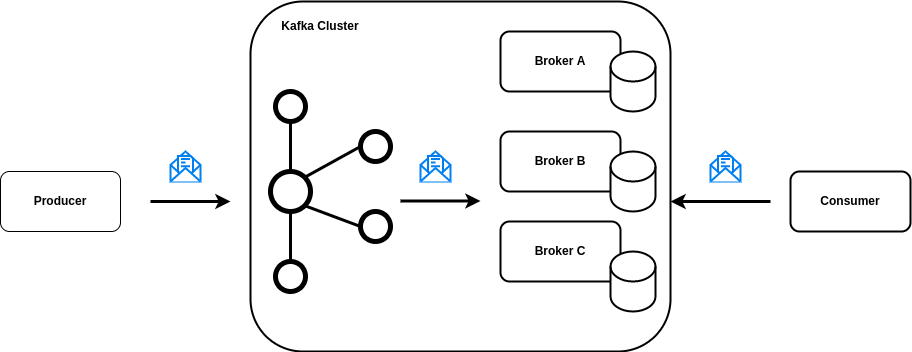

1. Existe um *Producer* e um *Consumer*
2. O *Producer* quer enviar dados e o *Consumer* quer consumir estes dados
3. O *Producer* produz dados que são armazenados em algum nó (broker) dentro do cluster do Kafka
4. Os nós são máquinas que armazenam dados
5. Quando o *Consumer* quer consumir dados ele busca em um desses nós

> Atenção: Kafka não envia nenhuma mensagem para ninguém

### Tópicos

Tópico é o canal de comunicação responsável por receber e disponibilizar os dados enviados para o Kafka

> Atenção: Um tópico pode ser lido por diversos *Consumers*, diferentes de uma AWS SQS que a mensagem some depois de consumida, no Kafka essa mensagem não some

#### Tópico +- = Log

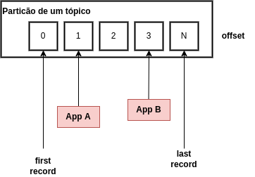

Quando uma mensagem é armazenada ela ganha um *offset*. O *offset* funciona como se fosse um ID para uma mensagem

### Anatomia de um registro

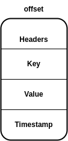

1. Headers: metadados
2. Key: contexto, tipo da mensagem (garantir ordem)
3. Value: payload
4. Timestamp

### Partições

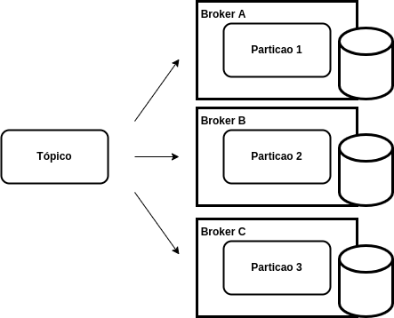

Cada tópico pode ter uma ou mais partições para conseguir garantir a distribuição e resiliência de seus dados

As partições de um mesmo tópico podem estar em brokers diferentes (máquinas diferentes)

Isso garante resiliência entre as mensagens

Também garante que possam ter mais que um *Consumer* consumindo um mesmo tópico, já que teremos mensagens distribuídas

### Garantindo Ordem

**Problema:** Um consumidor lento pode demorar para consumir uma mensagem que deve ser consumida antes de outras. Um consumidor rápido pode ser consumida antes de outra que deveria esperar: Problema de ordenação em filas.

**Solução:** Garantir a ordem de mensagens em diferentes partições

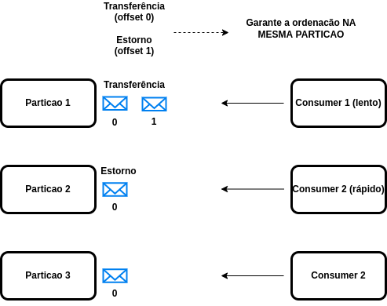

### Sobre as Keys

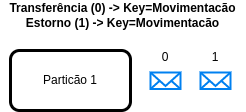

A Key garante que mensagens com mesma key estejam **NA MESMA PARTIÇÃO**

Sendo assim, garantimos a ordem dentro de uma partição

### Partições distribuídas

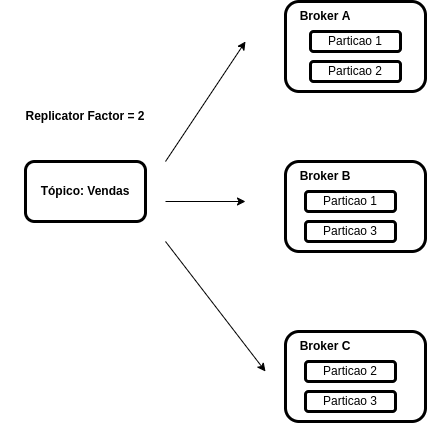

**Replicator Factor:** Diz que em cada broker deve ter *n* partições (cópicas)

Permite garantir maior resiliência

### Partition Leadership

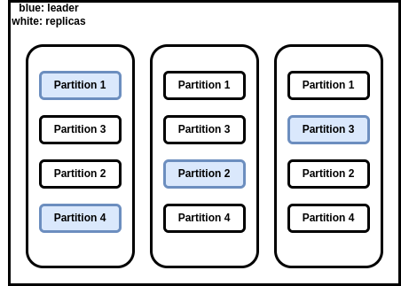

Um tópico quando lê um tópico, ele sempre tende a ler a partição líder

Um tópico só não lê de uma partição líder se ela estiver *down*

### Producer: Garantia de entrega

**Ack 0:** Não espera resposta

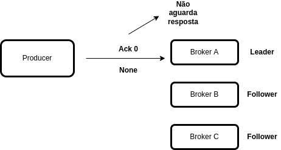

**Ack 1:** Leader envia confirmação se conseguir receber a mensagem

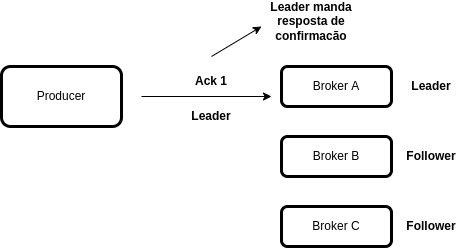

**Ack -1:** Leader envia confirmação se conseguire replicar para todos os followers

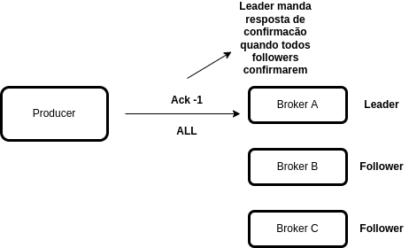

- **At most one:** Melhor performance. Pode perder algumas mensagens

- **At least once:** Performance moderada. Pode duplicar mensagens

- **Exacly once:** Pior performance. Exatamente uma vez

### Producer: Indepotência

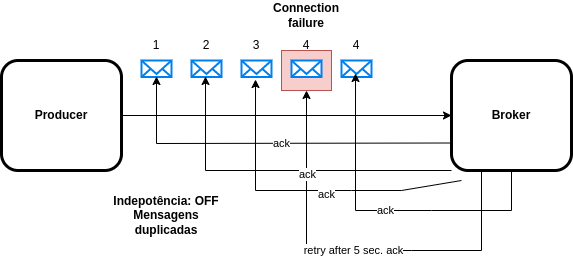

**Indepotência off:**

- Grava a mensagem 4 duplicada
- Consumer irá ler a mensagem 2 vezes

**Indepotência on:**

- Descarta a mensagem duplicada

### Consumers e Consumer Groups

Se tivermos apenas 1 Consumer e 3 partições de um tópico, esse consumer irá ler das 3 partições

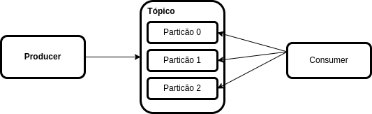

Se tivermos um grupo de consumidores e várias partições, o Kafka irá distribuir os consumers nas partições.

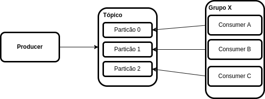